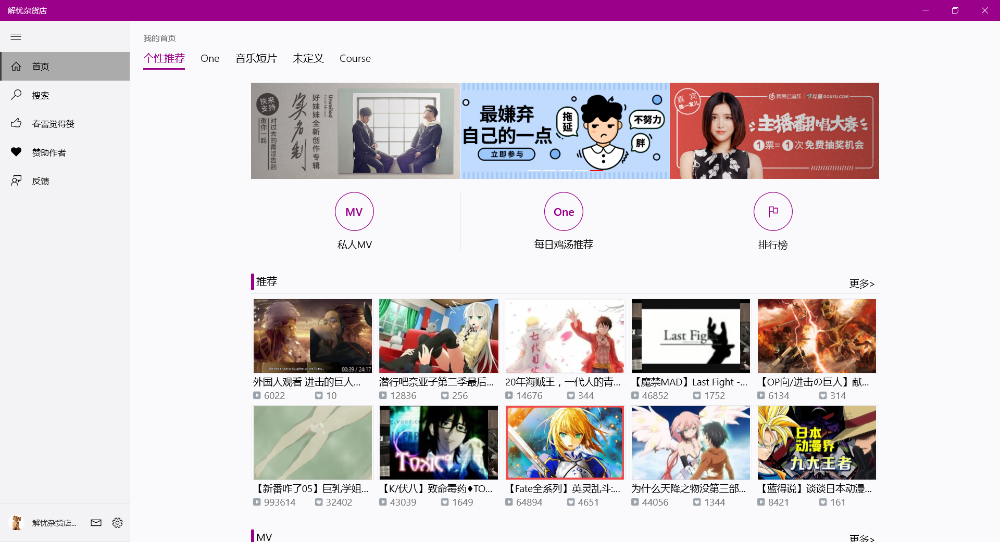
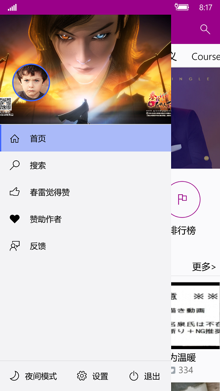
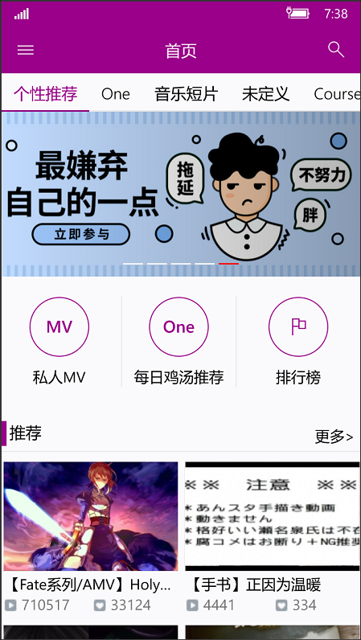
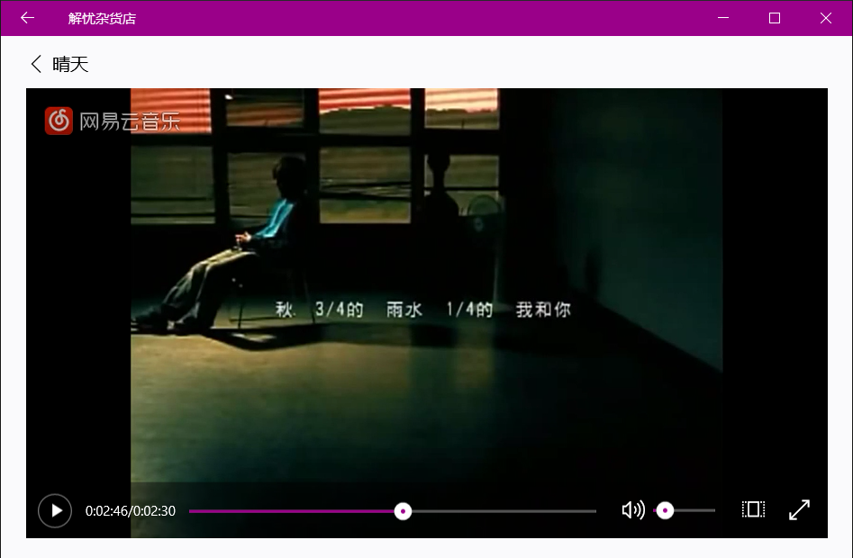
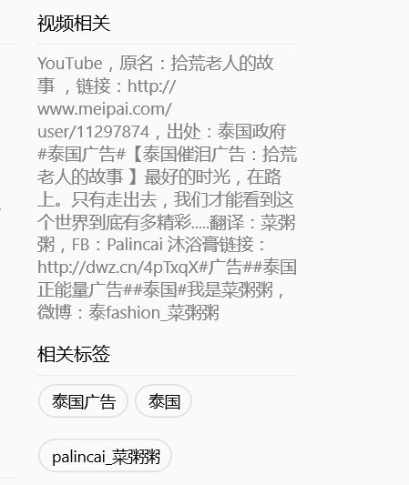
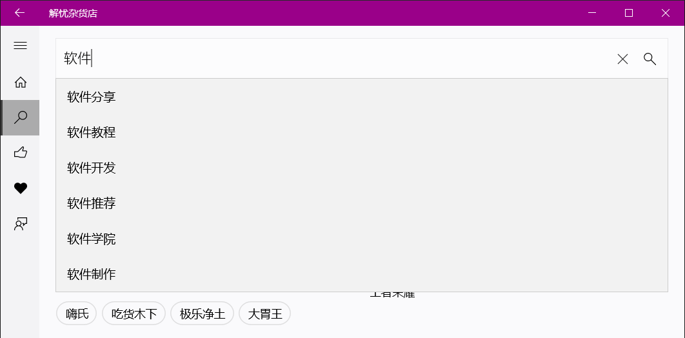
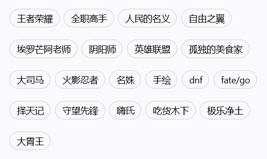
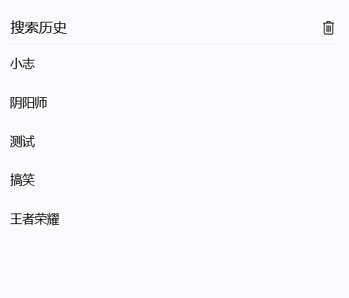
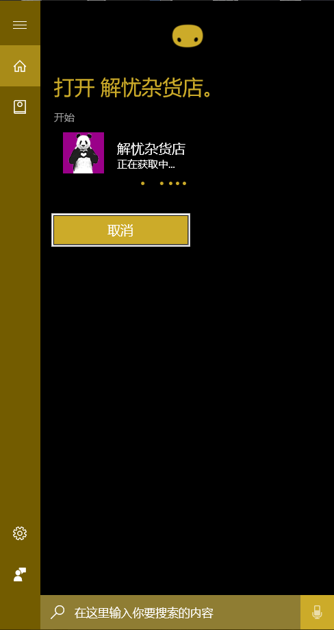
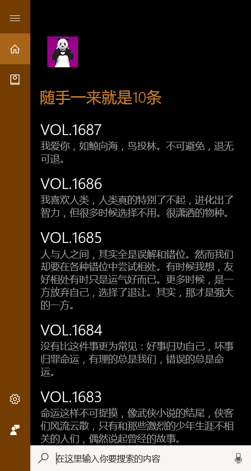

# Lansh

这个是我的毕设项目，本来开源在某云上，只是为了留个存档，斗转星移已逐渐忘记，昨天突然翻到便决定将其迁移到Github。
本项目简单来讲就是用C#写的UWP应用，当初的目的就是为了在毕设上与大家清一色写Java Web项目不同，总体来说当时的结局还是好的。
至于什么是UWP或许不是那么重要，因为它正在或已经成为过去时，但这并不是谁的错，我也没有损失什么，相反还学到了很多别人悟不到的知识。
然后就是，这个项目不会在维护了，它的存在更多的是为了代表过去的一段经历，那段不可磨灭的岁月。

Lansh是浪矢解忧杂货店的音译，那时刚好看了东野圭吾的这本书，正愁不知道取什么名字，这个信封就自己投进来了。

现在把项目运行起来恐怕不太容易，但苍白的文字勾勒不出项目的绚丽多彩，还好我翻到了当时填到论文里面的运行截图。

## 运行截图

**图片无排版，请随意感受**

    

    

    
    

    

    
    

    

    
    

    

    

    
    

**Cortana交互**

    
    
    

